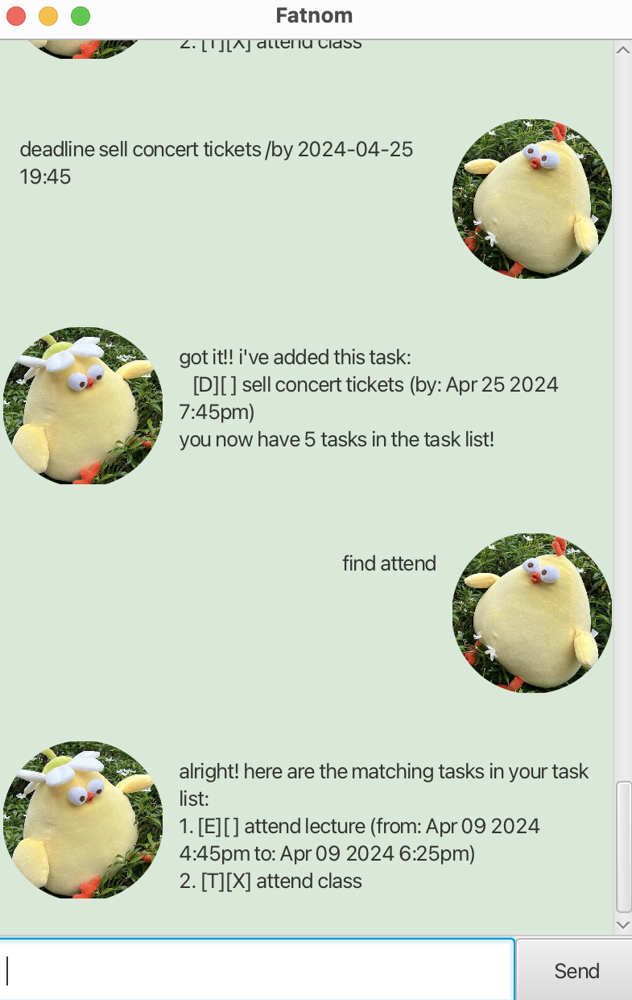

# Fatnom User Guide



Hello there!

Have you ever found yourself having many tasks to do, yet nowhere to keep track of them?

Fret not, Fatnom is here to help!

Fatnom is a command-line-based application that can help you to manage your task list.

Its simple commands will only take you _5 minutes to learn_!

All changes will be **saved automatically** - all your data will be saved every time you leave and restart the app.

So what are you waiting for? Install it right now for free!

## Installation

1. Download the latest release [here](https://github.com/moguries/ip/releases)
2. Move it to your desired folder
3. Open a command window in that folder
4. Run the command `java -jar Fatnom.jar`

## Supported Commands

### Add to-do task

You can add a to-do task to your task list.

Command format: todo [task description]

Example: `todo attend math lecture`

Expected output:

```
got it!! i've added this task:
 [T][] attend math lecture
you now have 1 tasks in the task list!
```

### Add task with a deadline

You can add a task with a deadline to your task list.

Command format: deadline [task description] /by [deadline]

Date-time format: YYYY-MM-DD HH:MM

Example: `deadline buy present /by 2024-01-01 17:00`

Expected output:

```
got it!! i've added this task:
 [D][] buy present (by: Jan 01 2024 5:00pm)
you now have 2 tasks in the task list!
```

### Add event with a start and end date

You can add an event with a start and end date to your task list.

Command format: event [task description] /from [start date] /to [end date]

Date-time format: YYYY-MM-DD HH:MM

Example: `event Fatnom's birthday party /from 2024-03-03 16:00 /to 2024-03-03 22:00`

Expected output:

```
got it!! i've added this task:
 [E][] Fatnom's birthday party (from: Mar 03 2024 4:00pm to: Mar 03 2024 10:00pm)
you now have 3 tasks in the task list!
```

### List tasks

You can list all the tasks in your task list.

Command format: list

Example: `list`

Expected output:

```
alright! here is your task list:
1.[T][] attend math lecture
2.[D][] buy present (by: Jan 01 2024 5:00pm)
3.[E][] Fatnom's birthday party (from: Mar 03 2024 4:00pm to: Mar 03 2024 10:00pm)
```

### Delete task

You can delete a task from your task list.

Command format: delete [task number]

Example: `delete 2`

Expected output:

```
got it!! i've deleted this task:
 [D][] buy present (by: Jan 01 2024 5:00pm)
you now have 2 tasks left in the task list!
```

### Mark task

You can mark a task as completed.

Command format: mark [task number]

Example: `mark 1`

Expected output:

```
good job!!! i've marked this task as done:
 [T][X] attend math lecture
```

### Unmark task

You can unnmark a task.

Command format: unmark [task number]

Example: `unmark 1`

Expected output:

```
okay! i've unmarked this task:
 [T][] attend math lecture
```

### Find tasks

You can find tasks containing a specified keyword.

Command format: find [keyword]

Example: `find party`

Expected output:

```
alright! here are the matching tasks in your task list:
1.[E][] Fatnom's birthday party (from: Mar 03 2024 4:00pm to: Mar 03 2024 10:00pm)
```

### Access help page

You can access the help page.

Command format: help

Example: `help`

Expected output:

```
_____________________________________
Help Page\n"
_____________________________________

hello!! here is the list of available commands:

     1. list
     function: list all tasks in your task list
     command format: list
     
     2. todo
     function: add a to do task
     command format: todo [task description]

     3. deadline
     function: add a task with a deadline
     command format: deadline [task description]
     /by [deadline]
     date time format: YYYY-MM-DD HH:MM

     4. event
     function: add an event with a start
     and end date
     command format: event [task description]
     /from [start date] /to [end date]
     date time format: YYYY-MM-DD HH:MM

     5. mark
     function: mark a task as completed
     command format: mark [task number]

     6. unmark
     function: unmark a task
     command format: unmark [task number]

     7. delete
     function: delete a task
     command format: delete [task number]

     8. find
     function: find tasks with the specified
     keyword
     command format: find [keyword]

     9. bye
     function: close the chatbot
     command format: bye
```

### Say bye

You can say bye to Fatnom, which will automatically close the application after 2 seconds.

Command format: bye

Example: `bye`

Expected output:

```
bye!! come visit me again! :D
   ∧,,,∧
(  ̳• · • ̳)
/    づ♡"
```

## Thank you for supporting Fatnom!

Stay tuned for upcoming updates and new features!